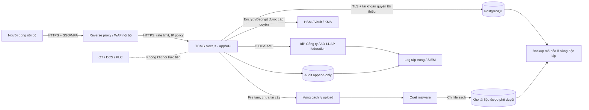

# Kiến trúc ATTT đích cho TCMS

## 1. Thông tin tài liệu

| Thuộc tính | Giá trị |
|---|---|
| Hệ thống | Web quản lý hợp đồng VH1 (TCMS) |
| Trạng thái | DRAFT - Chờ Chủ hệ thống và Bộ phận IT/ATTT phê duyệt |
| Căn cứ chính | CS-ATTT-KTAT-21; ISO/IEC 27001:2022 A.8.25-A.8.31 |
| Phạm vi | Đăng nhập, phân quyền, audit, database, mã hóa, backup, môi trường và DevSecOps |
| Ngoài phạm vi hiện tại | Kết nối OT/DCS/PLC; nhập dữ liệu vận hành thật; triển khai sản xuất |

## 2. Kết luận kiến trúc

TCMS sẽ chuyển từ ứng dụng chỉ chạy trên trình duyệt sang mô hình ứng dụng nội bộ nhiều người dùng:

1. Người dùng đăng nhập bằng SSO của Công ty; không tạo kho mật khẩu riêng nếu không có phê duyệt đặc biệt.
2. Quyền được kiểm tra tại backend theo cả vai trò và phạm vi dữ liệu, không dựa vào việc ẩn/hiện nút trên giao diện.
3. PostgreSQL là kho dữ liệu tập trung được đề xuất, có ràng buộc toàn vẹn, giao dịch, backup và Row-Level Security làm lớp phòng vệ bổ sung.
4. Mọi thay đổi nghiệp vụ quan trọng tạo audit event bất biến trong cùng giao dịch dữ liệu.
5. Dữ liệu nhạy cảm được mã hóa theo trường bằng AES-GCM/envelope encryption; khóa do HSM/Vault/KMS quản lý và xoay vòng.
6. Tài liệu hợp đồng không lưu trực tiếp trong mã nguồn hoặc localStorage. File đi qua vùng cách ly, kiểm tra loại/kích thước và quét malware trước khi vào kho được phê duyệt.
7. DEV, TEST/UAT và PROD tách biệt về máy chủ, database, danh tính ứng dụng, khóa, miền truy cập và kho file.
8. Mọi bản phát hành qua Git nội bộ và pipeline có kiểm tra ATTT, phê duyệt, backup/migration plan và rollback plan.

## 3. Giả định và điểm phải xác nhận

### Giả định thiết kế

- TCMS chỉ phục vụ người dùng nội bộ qua mạng Công ty/VPN được phê duyệt.
- Công ty đã có Active Directory/LDAP hoặc một Identity Provider hỗ trợ OIDC/SAML.
- Dữ liệu hợp đồng, nhà thầu, nhân sự giám sát và tài liệu đính kèm ít nhất thuộc nhóm `NỘI BỘ`; một số trường thuộc nhóm `MẬT/NHẠY CẢM`.
- TCMS không giao tiếp trực tiếp với hệ thống điều khiển công nghiệp.
- Hạ tầng chính thức ưu tiên on-premises hoặc private cloud do Công ty quản lý.

### Điểm chờ IT/ATTT quyết định

| Mã | Quyết định cần phê duyệt |
|---|---|
| D-01 | GitHub hiện tại có được phép dùng hay phải chuyển toàn bộ sang Git nội bộ? |
| D-02 | IdP/SSO chính thức là gì; có OIDC/SAML hay cần lớp liên kết AD/LDAP? |
| D-03 | PostgreSQL và các công cụ đề xuất có nằm trong danh mục 1826/QĐ-EVN? |
| D-04 | Vault/HSM/KMS nào đã có sẵn; ai là đơn vị quản trị khóa? |
| D-05 | Kho tài liệu được phép: DMS/SharePoint/MinIO/Google Drive hay hệ thống nội bộ khác? |
| D-06 | Công cụ quét malware nào được phê duyệt? |
| D-07 | Phân loại dữ liệu, thời hạn lưu dữ liệu và thời hạn lưu audit log? |
| D-08 | RPO/RTO chính thức và vị trí lưu bản backup ngoài hệ thống chính? |
| D-09 | Nhóm nào được phép truy cập PROD và quy trình cấp/thu hồi quyền? |

Không triển khai production khi D-01 đến D-09 chưa có chủ sở hữu và quyết định được ghi nhận.

## 4. Phân loại dữ liệu

| Nhóm | Ví dụ trong TCMS | Biện pháp tối thiểu |
|---|---|---|
| Công khai | Không mặc định có | Chủ dữ liệu phê duyệt trước khi công bố |
| Nội bộ | Số hợp đồng, gói thầu, tiến độ, đơn vị chủ trì | Đăng nhập, RBAC/ABAC, TLS, backup, audit thay đổi |
| Mật/Nhạy cảm | Giá trị hợp đồng, điều khoản, thông tin liên hệ cá nhân, nội dung chỉ đạo, hồ sơ đính kèm | Quyền theo dữ liệu, mã hóa theo trường/file, che dữ liệu trên UI/log, xuất dữ liệu có kiểm soát |
| Tối mật hệ thống | Token, khóa mã hóa, credential database, khóa ký | Không lưu trong database nghiệp vụ, mã nguồn, log hoặc file cấu hình; chỉ lưu HSM/Vault/KMS |

Chủ dữ liệu phải xác nhận lại bảng trên trước khi tạo schema production.

## 5. Sơ đồ kiến trúc và ranh giới tin cậy



### Phân vùng đề xuất

| Vùng | Thành phần | Luồng được phép |
|---|---|---|
| Vùng người dùng | Máy trạm nội bộ | Chỉ HTTPS đến reverse proxy |
| Vùng truy cập | Reverse proxy/WAF | HTTPS đến App; không truy cập trực tiếp DB |
| Vùng ứng dụng | TCMS App/API, worker | DB, IdP, KMS, antivirus, object store theo allowlist |
| Vùng dữ liệu | PostgreSQL, kho tài liệu | Chỉ nhận từ tài khoản dịch vụ/worker được cấp quyền |
| Vùng an ninh | IdP, KMS, log/SIEM | Quản trị riêng, MFA, audit bắt buộc |
| Vùng backup | Bản backup mã hóa/immutable | Tài khoản backup riêng; App không có quyền xóa |
| Vùng OT | DCS/PLC/hệ điều khiển | Không có route trực tiếp từ TCMS ở phạm vi này |

## 6. Đăng nhập và quản lý phiên

### Phương án ưu tiên

1. `Ưu tiên 1`: dùng trực tiếp Identity Provider/SSO Công ty qua OIDC hoặc SAML.
2. `Ưu tiên 2`: nếu AD/LDAP chưa cung cấp OIDC/SAML, sử dụng một Identity Broker được phê duyệt (ví dụ Keycloak) để liên kết AD/LDAP và phát hành OIDC cho TCMS.
3. Không đồng bộ/lưu mật khẩu AD vào database TCMS.
4. Không tự xây chức năng quên mật khẩu/đổi mật khẩu nếu danh tính do Công ty quản lý.

### Yêu cầu phiên đăng nhập

- MFA bắt buộc với quản trị hệ thống, quản trị phân quyền và kiểm toán; đề xuất mở rộng cho toàn bộ người dùng.
- Cookie phiên: `HttpOnly`, `Secure`, `SameSite=Lax/Strict` theo luồng SSO; chống CSRF cho thao tác thay đổi dữ liệu.
- Phiên có thời hạn không hoạt động và thời hạn tối đa; giá trị cụ thể do IT/ATTT phê duyệt.
- Thu hồi phiên khi tài khoản bị khóa, người dùng chuyển đơn vị hoặc bị thu hồi vai trò.
- Giới hạn tốc độ, chống brute force và cảnh báo đăng nhập bất thường tại IdP/reverse proxy.
- Có tài khoản `break-glass` quản trị khẩn cấp, lưu giữ theo quy trình hai người kiểm soát và kiểm tra định kỳ; không dùng cho vận hành thường ngày.

## 7. Phân quyền

Áp dụng kết hợp:

- `RBAC`: vai trò xác định nhóm chức năng.
- `ABAC/data scope`: đơn vị, hợp đồng được phân công và nhóm giám sát xác định bản ghi được xem/sửa.
- `Field-level authorization`: trường tài chính, phân quyền và cấu hình chỉ vai trò phù hợp được sửa.
- `Deny by default`: người dùng mới không có quyền nghiệp vụ cho đến khi được cấp rõ ràng.
- Kiểm tra quyền tại service/API và bổ sung PostgreSQL RLS; giao diện chỉ là lớp trình bày.

Ma trận chi tiết nằm tại [rbac-matrix.md](../security/rbac-matrix.md).

## 8. Database tập trung

### Công nghệ đề xuất

PostgreSQL trên hạ tầng nội bộ/được quản lý, chờ xác nhận danh mục công nghệ. Không cho trình duyệt kết nối trực tiếp database.

### Schema logic tối thiểu

| Bảng/nhóm | Mục đích |
|---|---|
| `users` | Chỉ lưu định danh IdP, tên hiển thị, đơn vị, trạng thái; không lưu mật khẩu |
| `departments` | Danh mục đơn vị và cấu trúc dữ liệu |
| `roles`, `permissions`, `user_role_scopes` | Vai trò, quyền và phạm vi đơn vị/hợp đồng |
| `contracts` | Dữ liệu nhận diện, thời hạn, trạng thái, tiến độ; có `version` chống ghi đè |
| `contract_departments` | Đơn vị chủ trì/tham gia và quyền trên từng hợp đồng |
| `contract_supervisors` | Nhân sự giám sát, vai trò và khoảng thời gian phân công |
| `contract_events` | Mốc tiến độ, chỉ đạo, tồn tại và nghiệm thu có lịch sử |
| `documents` | Metadata, hash, trạng thái quét malware và vị trí file; không chứa secret |
| `audit_events` | Nhật ký append-only |
| `outbox_events` | Phát sự kiện an toàn sau giao dịch để gửi log/thông báo |

### Kiểm soát database

- Mỗi môi trường một database/cluster và credential riêng.
- App sử dụng tài khoản không phải owner/superuser; migration dùng tài khoản riêng trong pipeline.
- Ràng buộc foreign key, unique, check và transaction bảo vệ toàn vẹn.
- Optimistic locking bằng `version` để cảnh báo hai người sửa cùng lúc.
- RLS theo `department_id`, phân công hợp đồng và vai trò làm lớp phòng vệ bổ sung.
- Không trả raw SQL/error/stack trace cho người dùng.
- Migration chỉ chạy từ pipeline đã phê duyệt; cấm sửa schema/data production thủ công trừ quy trình khẩn cấp có audit.

## 9. Audit log

### Sự kiện phải ghi

- Đăng nhập thành công/thất bại, đăng xuất, MFA và khóa tài khoản: lấy từ IdP và tập trung về SIEM.
- Cấp/thu hồi vai trò, thay đổi phạm vi dữ liệu.
- Tạo, sửa, chuyển trạng thái, lưu trữ/xóa hợp đồng.
- Thêm/xóa nhân sự giám sát; thay đổi tiến độ, thời hạn, chỉ đạo và thanh toán.
- Upload, download, thay thế, cách ly và xóa tài liệu.
- Xuất dữ liệu, backup/restore, migration và thao tác quản trị.
- Từ chối truy cập và các lỗi kiểm soát ATTT.

### Cấu trúc audit event

`event_id`, `occurred_at_utc`, `environment`, `actor_id`, `actor_roles`, `action`, `resource_type`, `resource_id`, `result`, `reason`, `before_diff`, `after_diff`, `correlation_id`, `session_id_hash`, `source_ip`, `user_agent`, `app_version`.

### Bảo vệ audit

- App chỉ có quyền `INSERT`; không có `UPDATE/DELETE` trên audit store.
- Audit nghiệp vụ ghi trong cùng transaction với thay đổi hoặc qua transactional outbox để không mất dấu vết.
- Không ghi mật khẩu, token, khóa, cookie, nội dung file hoặc dữ liệu cá nhân không cần thiết vào log.
- Log được chuyển sang hệ thống tập trung/immutable nếu hạ tầng cho phép; quyền đọc log tách khỏi quyền quản trị ứng dụng.
- Thời hạn lưu và quy trình cung cấp log do IT/ATTT phê duyệt.

## 10. Mã hóa và quản lý khóa

| Lớp | Kiểm soát |
|---|---|
| Truyền tải | TLS giữa client-proxy, proxy-app, app-DB/IdP/KMS/object store; chứng thư do PKI được phê duyệt |
| Database/storage | Mã hóa volume/tablespace và backup; quyền hệ điều hành tối thiểu |
| Trường nhạy cảm | AES-GCM/envelope encryption; ciphertext kèm key version, nonce và authentication tag |
| Tài liệu | Mã hóa phía kho lưu trữ; file hash để phát hiện thay đổi; quyền tải theo hợp đồng |
| Khóa | HSM/Vault/KMS; tách quyền quản trị khóa và quản trị app; xoay khóa, rewrap và audit |
| Secret ứng dụng | Lấy động từ secret manager; không commit, không hardcode, không lưu trong file cấu hình production |

Không mã hóa tràn lan mọi cột: trước tiên xác định trường cần tìm kiếm/sắp xếp, sau đó chọn mã hóa, tokenization hoặc che dữ liệu phù hợp. Khóa backup phải tách khỏi nơi lưu backup và có quy trình khôi phục khóa.

## 11. File và tài liệu hợp đồng

1. Kiểm tra quyền upload theo hợp đồng.
2. Giới hạn loại file, dung lượng, số lượng; chuẩn hóa tên và không dùng tên file làm đường dẫn vật lý.
3. Upload vào vùng cách ly với quyền không thực thi.
4. Tính hash, quét malware và ghi kết quả audit.
5. Chỉ file sạch mới chuyển vào kho tài liệu chính thức; file lỗi/quá hạn bị xóa theo quy trình.
6. Download qua API có kiểm tra quyền hoặc signed URL thời hạn ngắn; không công khai link cố định.

## 12. Backup, khôi phục và rollback

### Mục tiêu đề xuất chờ phê duyệt

| Chỉ tiêu | Đề xuất ban đầu |
|---|---|
| RPO production | 15 phút |
| RTO production | 4 giờ |
| DEV/TEST | Backup tối thiểu hằng tuần theo CS-ATTT-KTAT-21 |

### Chiến lược

- PostgreSQL: base backup định kỳ và lưu WAL liên tục để khôi phục theo thời điểm (PITR).
- Kho tài liệu: versioning/snapshot và backup đồng bộ với metadata database.
- Bản backup mã hóa, hash/manifest kiểm tra toàn vẹn và ít nhất một bản ở vùng/tài khoản độc lập; App không có quyền xóa.
- Đề xuất 3-2-1: ba bản sao, hai loại phương tiện/vùng lưu trữ, một bản tách biệt/immutable; IT xác nhận khả năng áp dụng.
- Kiểm tra job backup hằng ngày; diễn tập restore hàng quý và trước thay đổi lớn.
- Không coi backup thành công nếu chưa kiểm thử khôi phục và đối chiếu dữ liệu/file/audit.

### Rollback phát hành

- Mỗi release có artifact bất biến, release note, migration plan và rollback plan.
- Migration ưu tiên backward-compatible; backup/restore point trước migration có rủi ro.
- Rollback ứng dụng không tự động rollback database nếu có nguy cơ mất dữ liệu; phải dùng kế hoạch migration ngược hoặc roll-forward đã thử ở UAT.

## 13. Phân tách môi trường

| Thuộc tính | DEV | TEST/UAT | PROD |
|---|---|---|---|
| Dữ liệu | Dữ liệu giả | Dữ liệu giả/ẩn danh được phê duyệt | Dữ liệu thật |
| Domain | Riêng | Riêng | Riêng |
| IdP client/realm | Riêng | Riêng | Riêng |
| Database | Riêng | Riêng | Riêng/HA theo RTO |
| KMS key/secret path | Riêng | Riêng | Riêng, quyền hạn chế nhất |
| Kho file | Bucket/thư mục riêng | Riêng | Riêng, backup/versioning |
| Quyền developer | Có theo nhu cầu | Triển khai qua pipeline | Không truy cập dữ liệu trực tiếp |
| Triển khai | Tự động | Tự động sau kiểm tra | Phê duyệt hai bước, artifact đã kiểm thử |

Không sao chép database PROD xuống DEV/TEST. Khi cần tái hiện lỗi, tạo bộ dữ liệu tổng hợp hoặc quy trình ẩn danh hóa được IT/ATTT phê duyệt.

## 14. Pipeline DevSecOps

```text
Commit Git nội bộ
  -> secret scan + kiểm tra quy tắc branch
  -> lint/typecheck/unit test
  -> SAST + dependency/license scan + SBOM
  -> build artifact/container bất biến
  -> deploy TEST/UAT
  -> integration test + DAST + security test
  -> phê duyệt nghiệp vụ và IT/ATTT
  -> backup/restore point + kiểm tra migration/rollback
  -> deploy PROD bằng tài khoản pipeline
  -> smoke test + giám sát + audit release
```

- Branch chính được bảo vệ; không push trực tiếp; bắt buộc review.
- Dependency bị lỗ hổng nghiêm trọng không được phát hành khi chưa có chấp thuận rủi ro bằng văn bản.
- Secret scan chạy trước commit và trong CI.
- Không dùng runner DEV tự do để truy cập PROD.
- Security testing và checklist CS-ATTT-KTAT-21 là điều kiện nghiệm thu.

## 15. Lộ trình chuyển đổi từ MVP

| Giai đoạn | Kết quả | Điều kiện hoàn thành |
|---|---|---|
| 0. Phê duyệt kiến trúc | D-01 đến D-09 có quyết định | Chủ hệ thống + IT/ATTT ký xác nhận |
| 1. Nền tảng an toàn | Git nội bộ, CI, DEV/TEST tách biệt, secret manager | Không còn secret/real data trong repo/dev |
| 2. SSO và quyền | OIDC/SAML, MFA, RBAC/ABAC phía server | Kiểm thử deny-by-default và quyền chéo đơn vị |
| 3. Database và audit | PostgreSQL schema, migration, audit append-only | Test toàn vẹn, concurrency và audit không sửa/xóa |
| 4. Chuyển UI khỏi localStorage | API server-side và kho dữ liệu tập trung | Dữ liệu mẫu được import; localStorage chỉ giữ tùy chọn UI không nhạy cảm |
| 5. Tài liệu an toàn | Quarantine, malware scan, approved object store | Test file độc hại, file giả mạo và quyền download |
| 6. Backup/DR | PITR, backup file, runbook restore | Restore drill đạt RPO/RTO đã phê duyệt |
| 7. UAT và nghiệm thu ATTT | DAST/SAST/dependency/source review | Checklist Phụ lục 1 hoàn tất, rủi ro còn lại được chấp nhận |
| 8. Production pilot | Nhóm người dùng giới hạn | Theo dõi log, hiệu năng, sự cố và rollback |

## 16. Nguồn kỹ thuật tham khảo

- Keycloak Server Administration Guide: LDAP/Active Directory federation, OIDC/SAML, OTP và WebAuthn: https://www.keycloak.org/docs/latest/server_admin/
- PostgreSQL Row Security Policies: https://www.postgresql.org/docs/current/ddl-rowsecurity.html
- PostgreSQL Continuous Archiving/PITR: https://www.postgresql.org/docs/current/continuous-archiving.html
- HashiCorp Vault Transit Secrets Engine: https://developer.hashicorp.com/vault/docs/secrets/transit
- OWASP ASVS: https://owasp.org/www-project-application-security-verification-standard/
- OWASP Logging Cheat Sheet: https://cheatsheetseries.owasp.org/cheatsheets/Logging_Cheat_Sheet.html

Các nguồn trên giải thích khả năng kỹ thuật, không thay thế phê duyệt công nghệ và quy trình nội bộ của Công ty.
